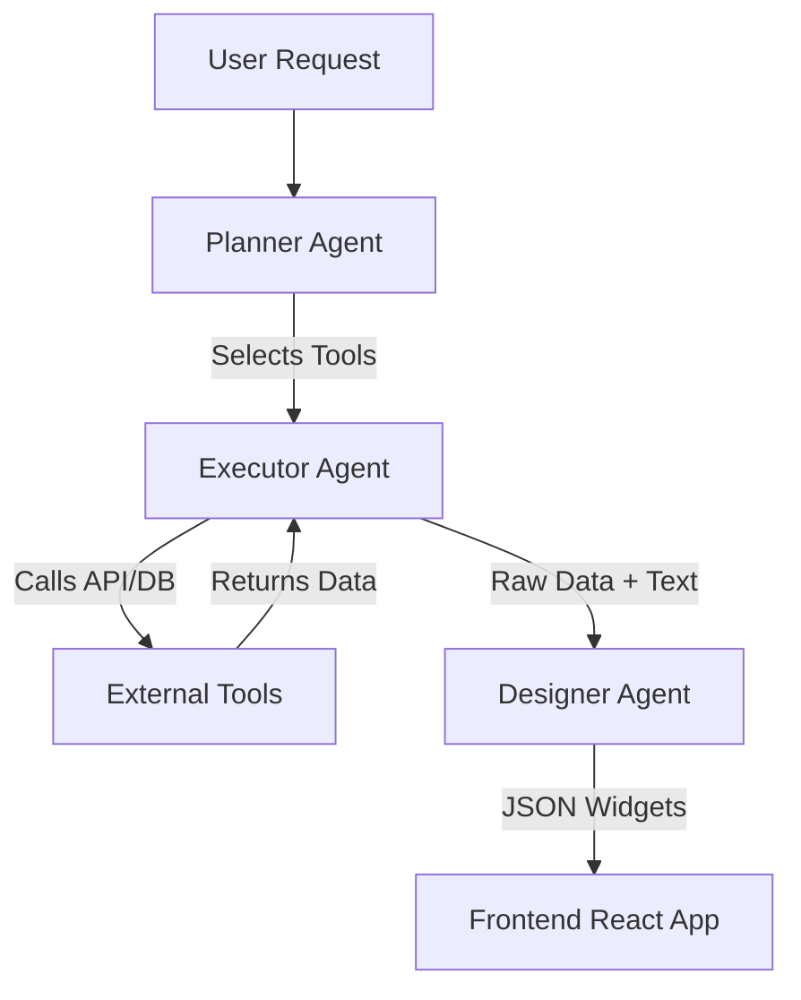

# Agent Architecture Documentation

## Overview
DynamicFront uses a **Multi-Agent Orchestrator** pattern to handle complex user requests while minimizing Google Gemini quota usage (429 Errors). Instead of a single monolithic prompt, we divide the work into specialized phases.

## The Problem: The 429 Quota Limit
Most 429 errors in GenAI are caused by sending **too many tokens** per minute (TPM). An "All-In-One" agent that has access to 50+ tools sends the definitions of *all* 50 tools (schema, description, args) with *every single message*. This clogs the context window and hits the limit rapidly.

## The Solution: Multi-Stage Processing
We break the request into three stages, each with a minimized context.

### 1. Planner Agent (The "Brain")
- **Role**: Analyzes the user's intent and selects the *exact* tools needed.
- **Context**: Receives only a *text summary* of available tools (name + description). It does NOT receive the heavy JSON schemas.
- **Output**: A JSON plan, e.g., `{ "tools": ["weather_forecast"] }`.
- **Benefit**: Extremely low token usage. We can list 100 tools in summary form for the cost of 5 active tools.

### 2. Executor Agent (The "Hands")
- **Role**: Executes the plan created by the Planner.
- **Context**: Receives only the **ACTIVE** tool definitions selected by the Planner.
- **Output**: Raw data and a natural language summary.
- **Benefit**: If the Planner selects 1 tool, the Executor only sees 1 tool schema. This drastically reduces the TPM payload.
- **Robustness**: Includes exponential backoff retry logic (2s, 4s, 8s) to handle transient 429 spikes.

### 3. Designer Agent (The "Artist")
- **Role**: Visualizes the data.
- **Context**: Receives the raw data from the Executor and the text summary.
- **Output**: A JSON array of UI Widgets (Charts, Tables, KPIs).
- **Safety**: Data is truncated at ~4k tokens to prevent the Designer pass from blowing the quota.

## Flow Diagram

## Adding New Agents
To extend this system, add methods to `server/agents/Orchestrator.js`.
Ensure you follow the pattern:
1. **Prepare Context**: Filter inputs to the minimum necessary.
2. **Execute Model**: Use `geminiManager.getPrimaryModel`.
3. **Handle Errors**: Always wrap in try/catch and use default fallbacks.
